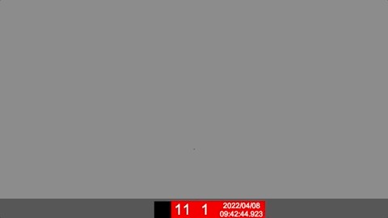
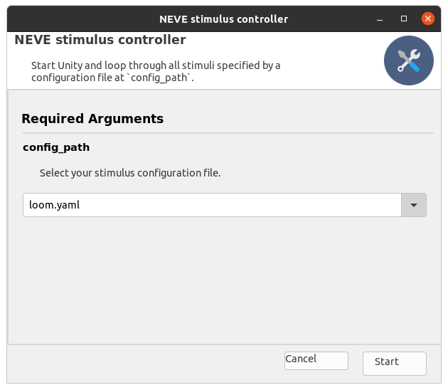
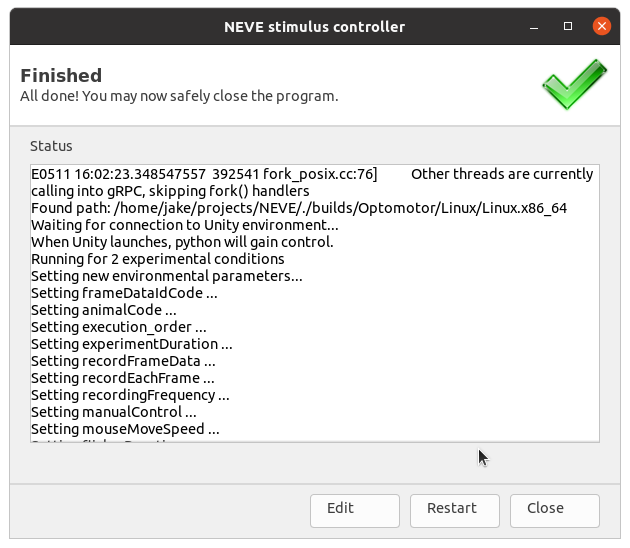
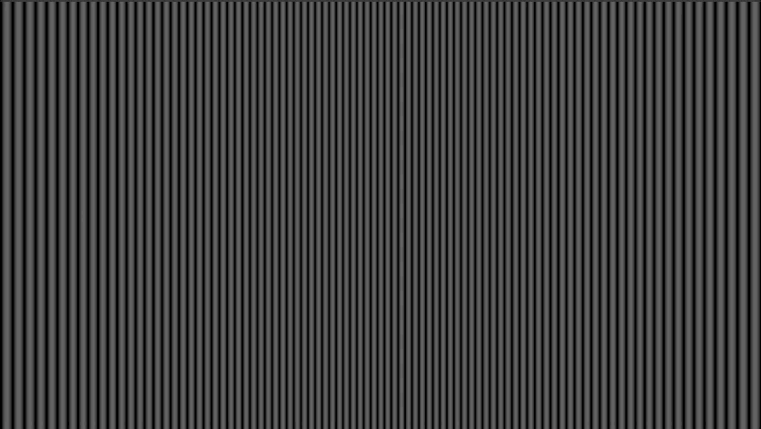

# NEVE toolkit

<p align="center">
  
  
</p>


Neuroecology virtual environments (NEVE) is a simple toolkit to build and run stimuli for behavioural and physiological experiments or reinforcement learning modelling.
NEVE uses the [Unity](https://unity.com/) engine to create and display perspectively correct stimuli at high-frame rates and in real time. Users can modify a set of
commonly-used pre-built experiments for their purposes with configuration files and control experiments from a simple app, via the command-line or python.

The following pre-built stimuli are provided:

| Stimulus | Description | Status |
| -------- | ----------- | ------ |
| Optomotor | Moving gratings that rotate around the viewer, used to identify the innate orienting behaviour caused by whole-field visual motion, known as an optomotor response. | Usable |
|Looming| Moving spheres or rectangles that approach a target, used to trigger escape responses. | Usable |
| Moving Objects | Similar to looming, however, one stimuli can be displayed and also rotate around the viewer. Can display either looming or translating objects. This is useful to observe tracking or escape behaviours. | WIP    |
| Dual Moving      | Similar to looming, however, up to two stimuli can be displayed and also rotate around the viewer. Can be used for selective attention experiments with either looming or translating objects. This is useful to observe tracking or escape behaviours and preference. | Usable |
| Moving rectangle | A simple 2D moving rectangle stimulus used to trigger responses from movement detector neurons in electrophysiology experiments. | Usable |


## Pre-built experiment example

### Install

#### Clone this repository

From the terminal or command-line:
```bash
git clone git@github.com:jakemanger/NEVE.git 
```

Or alternatively use [Github desktop](https://desktop.github.com/) to clone this project into your desired folder.


### Start NEVE

Depending on what operating system (OS) you are using, do the following to start NEVE (with a graphical user interface):

*Note, if these do not work for your OS, you can build one by
following [this guide](docs/building_executables.md) or follow
the [using with python guide](docs/docs/starting_an_experiment_from_python.md).*

#### Linux (tested on Ubuntu 20.04.3)

From the terminal, extract the executable

```
tar -xf NEVE_linux.tar.xz
```

and start NEVE

```
./NEVE_linux/control_simulation
```

#### Mac

Double click on `NEVE_mac.app.zip` to extract the app to the `NEVE` directory.

Double click on `NEVE_mac.app` to start NEVE.

#### Windows

Double click on `NEVE_windows.zip` and copy `NEVE_windows` to the `./NEVE` directory to extract.

Double click on `NEVE_windows/control_simulation.exe` to start NEVE.


### Run

Pick a desired stimulus to use from the drop down menu. In this example, we will use the stimulus for an optomotor experiment (`configs/optomotor.yaml`).



Click Start

and follow the prompts. You should see control-related messages in the status window and the
stimulus displayed on your designated screen (specified by your config file).

Expected status window output:



Expected stimulus with `./configs/optomotor.yaml`




Logs from each trial in the experiment (parameters of stimuli and timing of frames) will 
be continuously written and saved in the directory of the experiment i.e.
`trial_logs` as a csv file.

To view the frame rate reported from unity,
look at the difference in time (column t) in the csv output. Other data may also be present,
such as the timing of when a flash on the sync square was made (with a press of the F key)
or the position of a moving stimulus.


#### Modify a stimulus

If you want to modify a how a stimulus behaves, make changes to the stimulus's configuration file (found in the `configs` directory).
It's a good idea to copy and paste from an existing example configuration file if you are creating a new stimulus. If you do this, make sure the new configuration file
is inside the `configs` directory, or NEVE will not know how to find it.

*For an optomotor experiment, we could change the grating density in the
`configs/optomotor.yaml` file (or a copy of it) to be 800 in the first trial and 50 in the second
trial with speeds of 5 and 10 degrees per second, like so*:

```yaml
... LINE 48
# stimuli
density: [800, 50] # CHANGED FROM [400, 200]
offset: 0
angle: 0
speed: [5, 10] # CHANGED FROM 5 (FOR ALL TRIALS)
square: 0
minimumVal: [0, 0]
maximumVal: [0.1, 0.5]
...
```

*Note: The value you supply to each parameter should have a length equal to your number of trials
or a single value to indicate it is fixed for all trials. For example, if you wanted two trials 
with different density parameters but the same square parameter, supply an array the size of your
number of trials `density: [400, 200]` and a single value `square: 0`.*


## Run NEVE with python

NEVE can be run and controlled by python. This is useful for combining your experiments with machine learning models or some other custom setup.
To do this, follow [this guide](docs/starting_an_experiment_from_python.md).


## Run NEVE from the command line

NEVE can be run from the command line. This may be useful for some custom setups.
Specify the `--ignore-gooey` flag if you don't want to use a graphical user interface,
however this requires you to link a config file.

(on linux)
```
./NEVE_linux/control_simulation optomotor.yaml --ignore-gooey
```
(on windows)
```
NEVE_windows\control_simulation.exe optomotor.yaml --ignore-gooey
```
(on mac)
```
./NEVE_mac.app optomotor.yaml --ignore-gooey
```

Use the `-h` flag to get help.
(on linux)
```
./NEVE_linux/control_simulation -h
```


## Creating your own custom experiment

Users can also use a set of Unity prebuilt objects (prefabs) and environments (scenes) to rapidly
build an entirely new experiment. Sharing of custom built experiments is highly encouraged. See
the following guide for [creating a custom experiment](docs/creating_custom_experiment.md).


## Placing a reinforcement learning model in experiments

A big motivation to create NEVE was to allow machine learning models to see the same stimuli as
animals and react in the scene. By integrating the 
[Unity Python API](https://github.com/Unity-Technologies/ml-agents/blob/master/docs/Python-API.md)
and [Unity Machine Learning Agents Toolkit](https://github.com/Unity-Technologies/ml-agents), this
allows NEVE to performantly add inputs and outputs from machine learning models to the environment,
allowing a model to be trained to do the same task as an animal. This should then allow estimates 
of how animals process visual information to produce behaviours or recorded electrophysiogical responses.

To view the work in progress guide, see
[running a pre-built experiment for reinforcement learning](docs/running_prebuilt_experiment_for_reinforcement_learning.md).


## Calibrating screen parameters

You will commonly want to calibrate what stimulus's parameter translate to in the real
world (i.e., displayed from the screen). For example, you may want to identify what
parameters provide what intensity, so you can accurately control contrast in your
experiments. To do this, follow the work in progress guide at
[calibration](docs/calibration.md)
