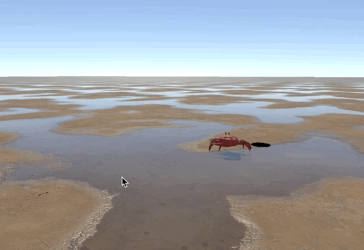
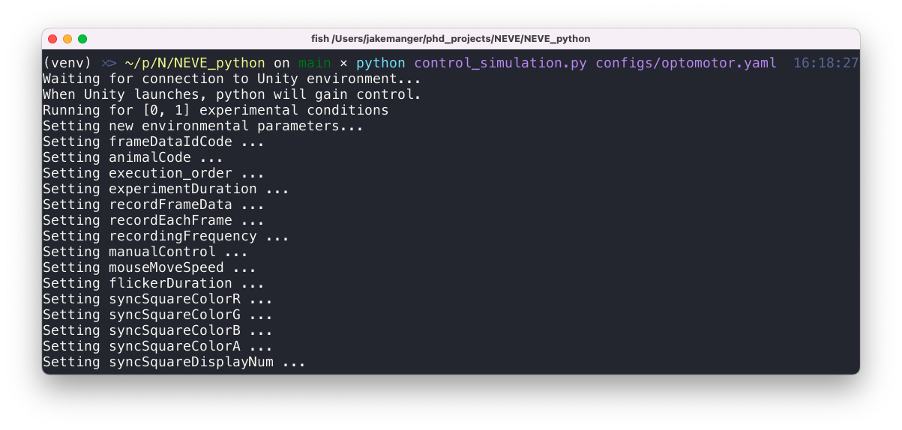

# NEVE toolkit

<p align="center">
  
  
</p>


Neuroecology virtual environments (NEVE) is a simple toolkit to build and run stimuli for behavioural and physiological experiments or reinforcement learning modelling.
NEVE uses the [Unity](https://unity.com/) engine to create and display perspectively correct stimuli at high-frame rates and in real time. Users can modify a set of
commonly-used pre-built experiments for their purposes with configuration files and control experiments from the command-line (via python).

The following pre-built stimuli are provided:

| Stimulus | Description | Status |
| -------- | ----------- | -------- |
| Optomotor | Moving gratings that rotate around the viewer, used to identify the innate orienting behaviour caused by whole-field visual motion, known as an optomotor response. | Usable |
|Looming| Moving spheres or rectangles that approach a target, used to trigger escape responses. | Usable |
| Moving           | Similar to looming, however, one stimuli can be displayed and also rotate around the viewer. Can display either looming or translating objects. This is useful to observe tracking or escape behaviours. | WIP    |
| Dual Moving      | Similar to looming, however, up to two stimuli can be displayed and also rotate around the viewer. Can be used for selective attention experiments with either looming or translating objects. This is useful to observe tracking or escape behaviours and preference. | Usable |
| Moving rectangle | A simple 2D moving rectangle stimulus used to trigger responses from movement detector neurons in electrophysiology experiments. | Usable |


## Pre-built experiment example

### Install

#### Clone this repository

From the terminal or command-line:
```bash
git clone git@github.com:jakemanger/NEVE.git 
```

Or alternatively use [Github desktop](https://desktop.github.com/) to clone this project into your desired folder.


#### Install python and dependencies

If you are unfamiliar with python and python virtual environments, see https://towardsdatascience.com/getting-started-with-python-virtual-environments-252a6bd2240

1. Install python 3.6 or greater, following installation instructions at [https://www.python.org/](https://www.python.org/).

2. Create a virtual environment in the NEVE_python directory

```bash
python3 -m venv venv
```

3. Activate your virtual environment

(on mac or linux)

```bash
source venv/bin/activate
```

(on windows)

```
venv\Scripts\Activate
```

4. Install dependencies

```bash
pip install -r requirements.txt
```

### Setup

Pick a desired experiment to use. In this example, we will use an optomotor experiment.

Make desired changes to the experiment's configuration file in the `NEVE_python/configs` directory.

*For an optomotor experiment, we could change the grating density in the
`configs/optomotor.yaml` file to be 800 in the first trial and 50 in the second
trial with speeds of 5 and 10 degrees per second, like so*:

```python
... LINE 48
# stimuli
density: [800, 50] # CHANGED FROM [400, 200]
offset: 0
angle: 0
speed: [5, 10] # CHANGED FROM 5 (FOR ALL TRIALS)
square: 0
minimumVal: [0, 0]
maximumVal: [0.1, 0.5]
...
```

*Note: The value you supply to each parameter should have a length equal to your number of trials
or a single value to indicate it is fixed for all trials. For example, if you wanted two trials 
with different density parameters but the same square parameter, supply an array the size of your
number of trials `density: [400, 200]` and a single value `square: 0`.*

### Run

Ensure you have an activated virtual environment (Install step 3 above).

Start the stimulus, specifying the configuration file to use:

```
python control_simulation.py ./configs/optomotor.yaml
```

and follow the prompts. You should see control-related messages in the terminal and the
stimulus displayed on your designated screen (specified by your config file).

Expected terminal output:



Expected stimulus with `./configs/optomotor.yaml`


Logs from each trial in the experiment (parameters of stimuli and timing of frames) will 
be continuously written and saved in the directory of the experiment i.e.
`NEVE_python/builds/Optomotor/trial_logs` as a csv file.

To view the frame rate reported from unity,
look at the difference in time (column t) in the csv output. Other data may also be present,
such as the timing of when a flash on the sync square was made (with a press of the F key)
or the position of a moving stimulus.


## Creating your own custom experiment

Users can also use a set of Unity prebuilt objects (prefabs) and environments (scenes) to rapidly
build an entirely new experiment. Sharing of custom built experiments is highly encouraged. See
the following guide for [creating a custom experiment](Docs/creating_custom_experiment.md).


## Placing a reinforcement learning model in experiments

A big motivation to create NEVE was to allow machine learning models to see the same stimuli as
animals and react in the scene. By integrating the 
[Unity Python API](https://github.com/Unity-Technologies/ml-agents/blob/master/docs/Python-API.md)
and [Unity Machine Learning Agents Toolkit](https://github.com/Unity-Technologies/ml-agents), this
allows NEVE to performantly add inputs and outputs from machine learning models to the environment,
allowing a model to be trained to do the same task as an animal. This should then allow estimates 
of how animals process visual information to produce behaviours or recorded electrophysiogical responses.

To view the work in progress guide, see
[running a pre-built experiment for reinforcement learning](Docs/running_prebuilt_experiment_for_reinforcement_learning.md).


## Calibrating screen parameters

You will commonly want to calibrate what stimulus's parameter translate to in the real
world (i.e., displayed from the screen). For example, you may want to identify what
parameters provide what intensity, so you can accurately control contrast in your
experiments. To do this, follow the work in progress guide at
[calibration](Docs/calibration.md)
